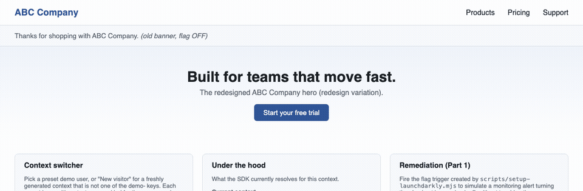
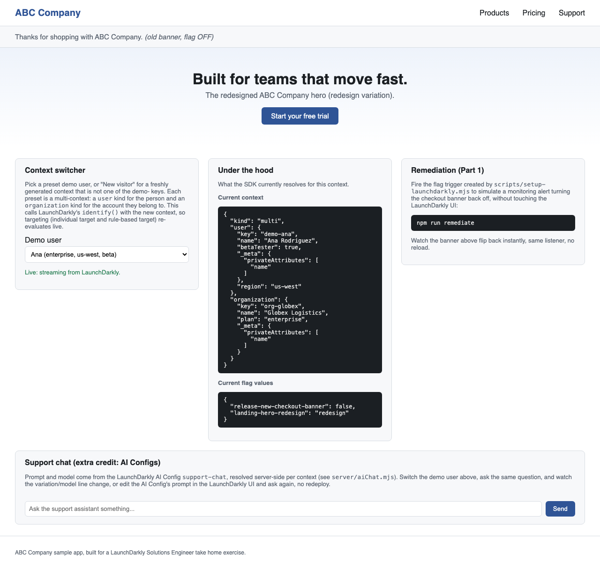
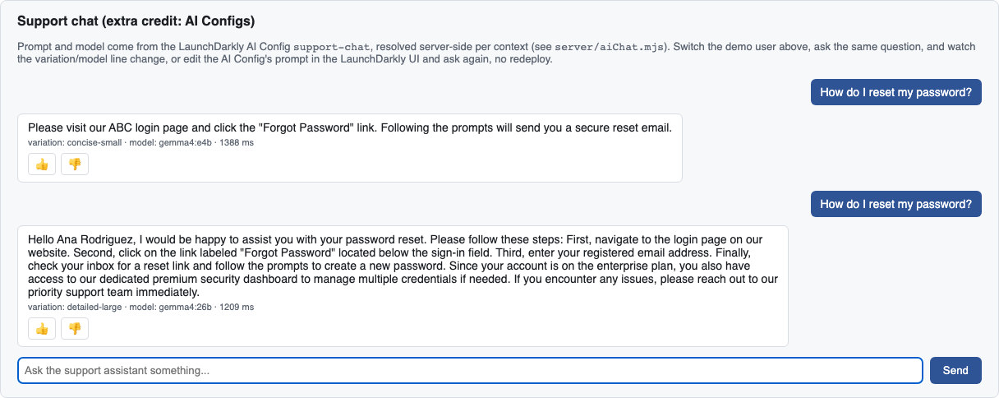

# ABC Company: shipping faster without adding risk, with LaunchDarkly

[](https://github.com/andreybuilt/launchdarkly-se-exercise/actions/workflows/ci.yml)

A sample app for a fictional **ABC Company** landing page. It runs locally, it
is reproducible from one setup command per feature, and every LaunchDarkly
concept in the exercise is something you can see happen on the page.

| The brief asks for | Where you see it |
|---|---|
| Release a feature behind a flag, roll it back | The checkout banner switches between old and new copy |
| Instant release and rollback, no reload | A `change` listener in the browser SDK swaps it live |
| Remediate with a trigger | `npm run remediate` (curl) turns the feature off, the page updates |
| Bonus: remediation with no human | A guarded rollout watches checkout errors and rolls back on its own |
| Context attributes, individual and rule-based targeting | The hero changes when you switch the demo user (a user + organization multi-context) |
| Extra credit: Experimentation | A running experiment on the hero, measured on CTA clicks |
| Extra credit: AI Configs | A support chat whose prompt, model and model settings come from LaunchDarkly |

Everything below was run end to end against a live LaunchDarkly trial account.



*Above: the banner flag is turned on in LaunchDarkly, then a trigger turns it
off again. The page never reloads.*

---

## Quick start (about 10 minutes)

**You need:** Node.js 20.19 or newer (or 22.9+) and a LaunchDarkly account. For the AI
Configs extra only: an OpenAI-compatible model endpoint, either a hosted
provider (set `LLM_BASE_URL` and `LLM_API_KEY`) or [Ollama](https://ollama.com)
locally. The two local models are about 10 GB and 18 GB to download and want a
machine with 32 GB of memory; with less, point `detailed-large` at a smaller
model in LaunchDarkly. The 10 minutes above do not include that download.

```bash
git clone https://github.com/andreybuilt/launchdarkly-se-exercise.git
cd launchdarkly-se-exercise
npm install
cp .env.example .env        # then fill in the three LaunchDarkly values below
```

From LaunchDarkly, copy into `.env`:

| Value | Where to find it | Used by |
|---|---|---|
| `LD_SDK_KEY` | Project settings > Environments > Test > SDK key | the server (Node SDK). Never sent to the browser |
| `LD_CLIENT_SIDE_ID` | same page, Client-side ID | the browser SDK, injected by the server at runtime |
| `LD_API_TOKEN` | Organization settings > Authorization > Create token (Writer role) | the setup scripts only, never the running app |

Then create everything the demo needs, in your own project, with one command
per feature. The npm scripts read `.env` themselves. Each setup script compares
every piece with the state it needs and changes only what differs, so it is
safe to re-run and it repairs a half-configured project; it stops with
LaunchDarkly's error message if a call fails.

```bash
npm run setup:ld           # Parts 1 and 2: two flags, targeting, a trigger
npm run setup:experiment   # extra credit: metric + experiment, started
npm run setup:ai           # extra credit: AI Config, two variations, targeting
npm start                  # http://localhost:8080
```

Prefer containers? `docker compose up --build` runs the same app from `.env`
(the image is built in two stages and runs as a non-root user). The commented
`ollama` service in `compose.yaml` adds a local model server for the AI Configs
extra; point `LLM_BASE_URL` at `http://ollama:11434`. How the pieces fit is in
[docs/ARCHITECTURE.md](docs/ARCHITECTURE.md).

`setup:ld` prints the trigger URL once (LaunchDarkly only shows a masked
version afterwards). Put it in `.env` as `LD_TRIGGER_URL`, or set
`LD_TRIGGER_URL_FILE=./trigger_url` before running it to have the URL written to
that file (mode 600, git-ignored) instead of the screen.

The defaults are project `default` and environment `test`. Set `LD_PROJECT_KEY`
and `LD_ENV_KEY` if yours differ.

---

## Part 1: Release and remediate

**Scenario.** Leadership wants features out faster; quality must not drop. The
answer is to separate *deploying* code from *releasing* it: the new code ships
dark behind a flag, is turned on when ready, and is turned off in seconds if it
misbehaves, without a rollback deploy.

- **The feature:** a new "Fall Launch" checkout banner, behind the boolean flag
  `release-new-checkout-banner`. It starts OFF in every environment.
- **Release and roll back:** turn the flag ON in LaunchDarkly and the open page
  shows the new banner; turn it OFF and the old one returns.
- **No reload:** `src/client.mjs` subscribes with
  `client.on('change:release-new-checkout-banner', ...)`. The browser SDK keeps a
  streaming connection open, so the change arrives within about a second.
- **Remediate:** the setup script creates a flag trigger whose only action is
  "turn this flag off". `scripts/remediate.sh` calls it with `curl`, exactly as a
  monitoring alert (Datadog, PagerDuty, a synthetic check) would. No one has to
  open the dashboard during an incident.

```bash
npm run remediate   # reads LD_TRIGGER_URL from .env, or the ./trigger_url file
```

The script passes the URL to `curl` on standard input, never as a command-line
argument, so it does not show up in the process list.

**Time to recover, measured on the trial account:** from firing the trigger to
the old banner being back in an open browser tab took 0.55 to 0.78 seconds over
three runs, with no person in the loop and no deploy.

Treat the trigger URL like a password: anyone who has it can turn the feature
off. When repeating the demo, leave a few seconds between turning the flag on
and firing the trigger: in testing, one rapid on-then-trigger sequence (about
three seconds apart) left the flag on.

## Part 2: Target

**Scenario.** The landing page redesign has 40,000 visitors a day watching it.
Release it to the people who should see it first, prove it, then widen it.

- **The component:** the landing page hero, behind the string flag
  `landing-hero-redesign` (`control` or `redesign`).
- **The context:** a multi-context, because a person and the company they belong
  to are different things. The `user` context carries `key`, `name`, `region`
  and `betaTester`; the `organization` context carries `key`, `name` (the
  company) and `plan` (free, pro, enterprise). Both `name` attributes are marked
  private: they can still be used for targeting, but they are left out of the
  analytics events the SDKs send, so LaunchDarkly does not store them. Six
  presets are defined in `server/contexts.mjs`: five demo users and a new
  visitor.
- **Individual targeting:** Eli (free plan, not a beta tester) is targeted by
  key and sees the redesign. Typical use: an internal tester or a design partner.
- **Rule-based targeting:** organization `plan is enterprise` serves the
  redesign, and so does user `betaTester is true`. A rule's clauses are AND'ed,
  so an OR is two rules that serve the same variation.
- **Demo users stay predictable:** a last rule, user `key starts with demo-`,
  serves `control`, so the five demo users never land in the experiment. The
  **New visitor** preset gets a fresh random key on every page load, matches no
  rule, and is bucketed by the experiment like real traffic.
- **Everyone else** falls through to the default rule, which is where the
  redesign is measured (see Experimentation).



On the page, the **context switcher** calls `client.identify()` with the chosen
user; the SDK re-evaluates and the hero changes with no reload. The **Under the
hood** panel shows the active context and both flag values. The server evaluates
the same flags for the same users at `GET /api/flags?user=<key>`.

| Preset | organization plan | user betaTester | Hero | Why |
|---|---|---|---|---|
| Ana | enterprise | true | redesign | enterprise rule (first match) |
| Ben | free | false | control | demo-user rule (no other rule matches) |
| Chen | pro | true | redesign | beta tester rule |
| Dana | enterprise | false | redesign | enterprise rule |
| Eli | free | false | redesign | individual target |
| New visitor | free | false | 50/50 | the experiment on the default rule |

## Demo script (5 minutes)

1. Open `http://localhost:8080` (Ana is selected). The page renders at once
   from flag values the server bootstrapped into it, then the status line
   changes to "Live: streaming from LaunchDarkly" when the stream is up.
2. **Release:** in LaunchDarkly, turn `release-new-checkout-banner` ON. The
   banner changes in the open tab.
3. **Remediate:** run `npm run remediate`. The banner reverts, and the
   flag's history in LaunchDarkly shows the trigger did it.
4. **Target:** switch to Ben (control), then Eli (individual target), then Chen
   (rule). The hero follows; the Under the hood panel shows why.
5. **Experiment:** pick New visitor and click the hero's button: that click
   counts. Then open Experiments > "Hero redesign: CTA conversion" (below).
6. **AI Config:** ask the support chat the same question as Ben and as Ana, then
   change the prompt in LaunchDarkly and ask again (below).

---

## Extra credit: Experimentation

**Scenario.** As the product manager, decide with data whether the redesign
should go to everyone.

- **Metric:** `hero-cta-click`, a custom conversion metric. The hero's button
  calls `client.track('hero-cta-click')` and flushes, and LaunchDarkly joins each
  click to the variation that visitor was served.
- **Experiment:** "Hero redesign: CTA conversion" on the same flag as Part 2,
  Bayesian, 50/50 between control and redesign, randomized by user. It runs on
  the flag's **default rule only**. Targeted users are not randomized (they were
  chosen to get the redesign), so including them would bias the estimate; they
  and the demo users are kept out.
- **Traffic:** a trial account has no visitors, so `scripts/simulate-traffic.mjs`
  plays them. Each simulated visitor gets a user context with `simulated: true`
  (and an organization on the free or pro plan), is
  evaluated by the server SDK like a real page view, and clicks with an
  **assumed** probability (8% for control, 11% for redesign). The experiment's
  job is to recover that difference from noisy data; the result says nothing
  about real visitors.

```bash
npm run simulate -- 3000 20   # 3,000 visitors at 20 per minute
```

Results: LaunchDarkly > Experiments > "Hero redesign: CTA conversion".

**Readout of the trial run (3,000 simulated visitors, 2026-10-09).**

| | Visitors | CTA clicks | Rate |
|---|---|---|---|
| Control | 1,495 | 108 | 7.2% |
| Redesign | 1,505 | 170 | 11.3% |

- **Traffic split** 49.8% to 50.2%: no sample ratio mismatch, so the allocation
  worked as configured.
- **Probability that the redesign beats control:** above 99.9%.
- **Relative lift:** about 56%, with a 90% credible interval of roughly 29% to
  90%.
- **Sanity check:** the simulator's assumed true lift is 37.5% (11% against
  8%). It sits inside the interval, so the experiment recovered a known effect
  from noisy data, which is what this run can prove.
- **Decision, as the product manager:** roll the redesign out to everyone and
  clean up the flag. With real traffic I would also watch a guardrail metric
  (for example bounce rate or checkout errors) before calling it.

These figures are computed from the simulator's own record of what it sent,
using the same Bayesian approach with uniform priors. LaunchDarkly's results
page for the experiment shows its own analysis of the same events.

## Extra credit: AI Configs

**Scenario.** As the AI product manager for a support chatbot, change prompts and
models quickly and see which works best, without waiting for a deploy.

- **AI Config `support-chat`** with two variations:
  - `concise-small`: a short, friendly prompt on a small, fast model
    (`gemma4:e4b`). Served to everyone by default.
  - `detailed-large`: a step-by-step prompt that uses the visitor's plan, on a
    larger model (`gemma4:26b`) with `reasoning_effort: none`. Served by the rule
    organization `plan is enterprise`.
- **The app** (`server/aiChat.mjs`) asks the AI SDK for the config for this
  visitor (`initAi(ldClient).completionConfig(...)`), fills in `{{companyName}}`,
  `{{userName}}` and `{{plan}}`, and calls the model with the model name and an
  allowlist of model parameters taken from the config (`temperature`, `top_p`,
  `max_tokens`, `reasoning_effort`). Duration, tokens, success or error, and the
  thumbs up/down feedback are recorded with the SDK's tracker, so LaunchDarkly's
  AI Config monitoring compares the variations.
- **Each reply** shows `variation · model · milliseconds`, so the audience can
  see which configuration answered.
- **Fails safe:** if LaunchDarkly cannot provide the config, the default is
  *disabled* and the chat says it is turned off, rather than quietly calling a
  hard-coded model. `POST /api/chat` is limited to 10 requests a minute per
  client and two model calls at a time.



**Why the model settings matter.** On the trial account the large model first
took about 13 seconds per answer: it was generating hidden reasoning tokens.
Setting `reasoning_effort: none` on that variation in LaunchDarkly brought it to
under 2 seconds, with no code change and no redeploy. That is the point of an AI
Config.

**Model provider.** The app speaks the OpenAI chat completions API
(`/v1/chat/completions`). The demo uses Ollama's compatible endpoint
(`LLM_BASE_URL`, default `http://localhost:11434`; run
`ollama pull gemma4:e4b && ollama pull gemma4:26b`). OpenAI, or any gateway that
offers the same API, works by setting `LLM_BASE_URL` and `LLM_API_KEY` (sent as a
bearer token) and pointing the model configs at that provider's model names.
Providers with a different API need an adapter in `server/aiChat.mjs`.

Try it: ask "How do I reset my password?" as Ben, then as Ana. Then edit
`concise-small`'s prompt in LaunchDarkly (for example "Always sign off as the
ABC Company team.") and ask again as Ben.

## Extra credit: guarded rollout (automatic remediation)

**Scenario.** Part 1's trigger needs something to call it. A guarded rollout
needs nothing: LaunchDarkly ramps the new banner up in steps, compares a metric
between old and new, and rolls back on its own if the new one is worse.

- **The signal:** only the new banner has a "Check out now" button. It calls
  `POST /api/checkout`, which evaluates `release-new-checkout-banner` for the
  visitor and records `checkout-completed` or `checkout-error` with the server
  SDK's `track()`.
- **The regression:** start the server with `CHECKOUT_REGRESSION=on` and the new
  banner's checkouts fail 40% of the time. With `DEMO_CONTROLS=on` you can flip
  it at runtime with `POST /api/demo/regression {"on": true}`, from the machine
  the server runs on only (anything else, or without the setting, gets 404; in
  Docker use the environment variable instead). `/api/checkout` is rate limited
  so it cannot be used to flood the metric.
- **Automated:** `npm run setup:guarded` creates the metric "Checkout error rate"
  (`checkout-error`, lower is better) and prints the UI steps.
  `npm run simulate:checkout` sends labelled simulated visitors through the flag
  (assumed error rates: 2% normally, 30% on the new banner with `-- --regression`)
  so the rollout has traffic to measure.
- **The one UI step:** starting the rollout. Open the flag in `test`, make sure
  it is ON with the default rule serving the old banner, set Serve to
  **Guarded rollout** on the new banner, metric "Checkout error rate" with
  automatic rollback, randomization unit `user`, shortest schedule. The REST API
  documents no single-flag call for this, so it is done in the UI.
- **Watch:** the flag's Monitoring tab: the ramp, the error rate per variation,
  and the automatic rollback when the regression is on.

Run it as its own demo, after Parts 1 and 2: the guarded rollout changes the
banner flag's default rule. When it is over, `npm run setup:ld -- --reset-demo`
puts the flag back (OFF, default rule serving the new banner) so Part 1's
on/off toggle behaves as described. A plain re-run never does this, so it
cannot undo a release in progress.

**Status:** the metric, the checkout signal and the simulator were run against
the trial account. The UI step and the automatic rollback have not been
exercised yet; this line will change when they have.

---

## Where keys go

| Key | Read by | Never |
|---|---|---|
| `LD_SDK_KEY` | `server/ldClient.mjs` | sent to the browser |
| `LD_CLIENT_SIDE_ID` | `server/index.mjs`, served as `/config.js` | hard-coded or bundled (it is not secret, but it is per environment) |
| `LD_API_TOKEN` | `scripts/setup-*.mjs` | used by the running app |
| `LD_TRIGGER_URL` (or `./trigger_url`) | `scripts/remediate.sh` | committed (`trigger_url` is git-ignored) |
| `LLM_API_KEY` (optional) | `server/aiChat.mjs` | logged or sent to the browser |

No key is in this repository. `.env` is git-ignored.

## Assumptions

- LaunchDarkly commercial cloud (`app.launchdarkly.com`), REST API version
  `20240415`, a project with a `test` environment.
- Node 20.19+ (or 22.9+) on macOS or Linux, or Docker; `curl` and `bash` for
  the remediation script.
- Five fixed demo users and a random new visitor for a repeatable demo, in place
  of a user directory.
- Experiment results come from simulated traffic with assumed click rates, and
  say so wherever they are shown.

## Tests

```bash
npm test
```

Offline tests (Node's `node:test`), with LaunchDarkly's `TestData` source in
place of the network and a fake model endpoint. The flag tests pin the targeting
this app depends on; the AI Config tests cover the app's own logic:

- the banner flag on and off changes what the server returns;
- the hero follows the multi-context rules: `redesign` for the individual target
  and both rules, `control` for the demo-user rule, the default rule for a new
  visitor;
- the AI Config picks the right variation and model per organization plan,
  fills in the prompt variables, forwards only allowlisted model parameters,
  sends a bearer key only when one is configured, stays off when LaunchDarkly
  cannot provide the config, and records success, error, duration, token and
  feedback events against the real user;
- the chat limiter enforces the request and concurrency limits.

CI runs the tests and the client build on Node 20 and 22 for every push.

Two browser SDK (v4) details the code relies on: the client does not connect
until `client.start()` is called, and the `change:<flag>` event carries the
context, not the new value, so each listener reads the value back with
`variation()`.

## Project layout

```
public/                        page, styles, built browser bundle
src/client.mjs                 browser: SDK start, change listeners, context switcher, CTA tracking, chat panel
server/index.mjs               Express: page, /config.js, /api/flags, /api/chat, /healthz
server/ldClient.mjs            Node server SDK setup
server/contexts.mjs            the demo users and the new visitor (user + organization multi-contexts)
server/aiChat.mjs              AI Config resolution, model call, tracking
scripts/setup-launchdarkly.mjs flags, targeting, trigger (REST API, idempotent)
scripts/setup-experiment.mjs   metric and experiment, started (REST API, idempotent)
scripts/setup-ai-config.mjs    model configs, AI Config, variations, targeting (REST API, idempotent)
scripts/simulate-traffic.mjs   labelled simulated visitors for the experiment
scripts/remediate.sh           fires the remediation trigger
scripts/setup-guarded-rollout.mjs  checkout-error metric, prints the guarded rollout UI steps
scripts/simulate-checkout.mjs  labelled simulated checkouts for the guarded rollout
server/checkout.mjs            the checkout signal (and the injectable regression)
scripts/build-client.mjs       esbuild bundle step (runs on npm start)
test/                          offline tests
docs/ARCHITECTURE.md           diagram, request flow, what changes for production
Dockerfile, compose.yaml       container build and one-command run
.github/workflows/ci.yml       tests and build on Node 20 and 22
```

## About this build

Designed by Andrey Shkanov (AndreyBuilt.ai); implemented with AI coding agents
working to that design, and verified end to end against a live LaunchDarkly trial.
