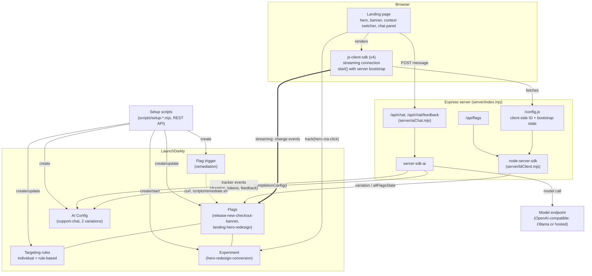

# Architecture

## Request flow

**Page load and bootstrap.** The browser requests `/config.js`, which the
server builds at request time: it reads `LD_CLIENT_SIDE_ID` from its own
environment (never baked into the bundle) and computes `allFlagsState()` for
the first preset demo context using the already-initialized server SDK. The
page's inline script assigns both to `window`, then `src/client.mjs` calls
`client.start()` with that bootstrap state as the initial value, so the
banner and hero render correctly on first paint instead of a placeholder that
flips once the stream connects.

**A flag toggle reaching the open tab.** Once `client.start()` resolves, the
browser SDK holds a streaming connection to LaunchDarkly. Changing a flag's
targeting in the LaunchDarkly dashboard pushes a `patch` over that stream;
the SDK re-evaluates and fires a `change:<flag key>` event. The page's
listener reads the new value back with `client.variation()` (the event
itself does not carry it) and updates the DOM, no reload.

**A trigger call.** `scripts/remediate.sh` issues a `curl` against the flag
trigger's webhook URL, exactly as an external monitor (synthetic check,
PagerDuty, Datadog) would. LaunchDarkly resolves the trigger to its single
configured action, turning the banner flag off, and pushes that change down
the same streaming connection: no dashboard, no deploy, no person in the
loop.

**A chat request.** The server validates the preset user and message, then
`server/aiChat.mjs` asks `server-sdk-ai` to resolve the `support-chat` AI
Config for that visitor's context (variation selection follows the same
targeting rules as a flag). The resolved prompt template is filled in with
visitor attributes, the model name and an allowlisted set of parameters are
sent to the model endpoint, and the SDK's tracker records duration, token
counts, success or error, and later thumbs up/down feedback back to
LaunchDarkly's AI Config monitoring.

## What changes for production

- **Relay Proxy.** A single server SDK instance in one process is fine for a
  demo; at scale, a Relay Proxy fleet in front of LaunchDarkly's streaming
  API reduces connection count and gives every server instance a local cache
  to fail over to.
- **SDK key handling and rotation.** `LD_SDK_KEY` here lives in `.env`, never
  the browser. In production it belongs in a secrets manager with scheduled
  rotation, and the deploy pipeline should fail closed if the key is
  missing rather than degrade silently.
- **Environments.** This demo runs against a single `test` environment.
  Production needs the usual LaunchDarkly ladder (e.g. development, staging,
  production) with its own SDK key and client-side ID per environment, and
  targeting changes promoted deliberately rather than made directly against
  production.
- **Flag cleanup for temporary flags.** `release-new-checkout-banner` is a
  temporary release flag; once the banner is fully rolled out it should be
  archived and the code path simplified, using LaunchDarkly's code
  references / stale flag detection to find the removal point.
- **Privacy (private attributes).** The demo marks both `name` attributes
  private. A private attribute can still be used for targeting, but it is
  stripped from the analytics events the SDKs send, so LaunchDarkly does not
  store it. Note the difference between SDKs: the server SDK evaluates
  locally, while the browser SDK sends the context to LaunchDarkly for
  evaluation, so a value that must never leave your network belongs in
  server-side evaluation only. Real visitor contexts should carry only what
  targeting needs.
- **Rate limits.** The REST API setup scripts here run once, interactively.
  Production automation that calls the LaunchDarkly REST API repeatedly
  (CI, bulk targeting changes) needs to respect LaunchDarkly's documented
  rate limits and back off on `429` responses, rather than retrying in a
  tight loop.
